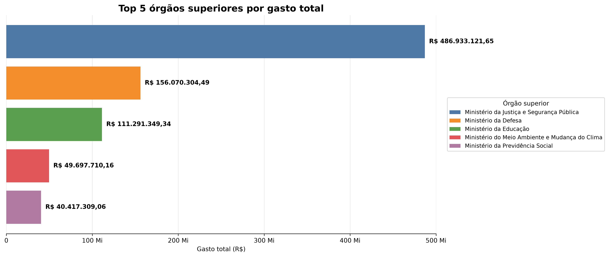
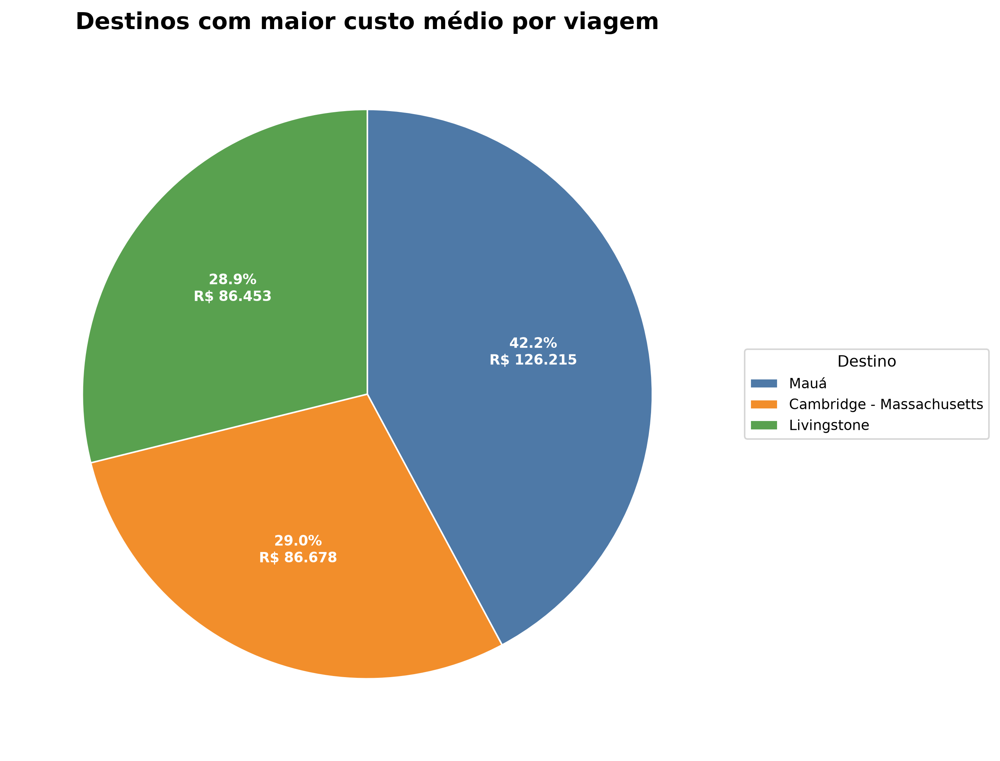
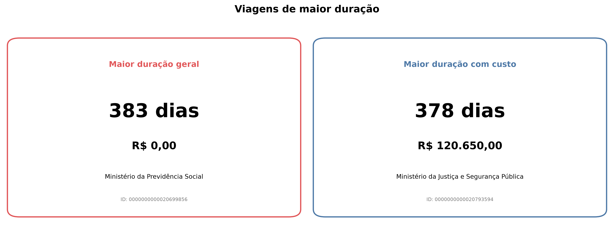
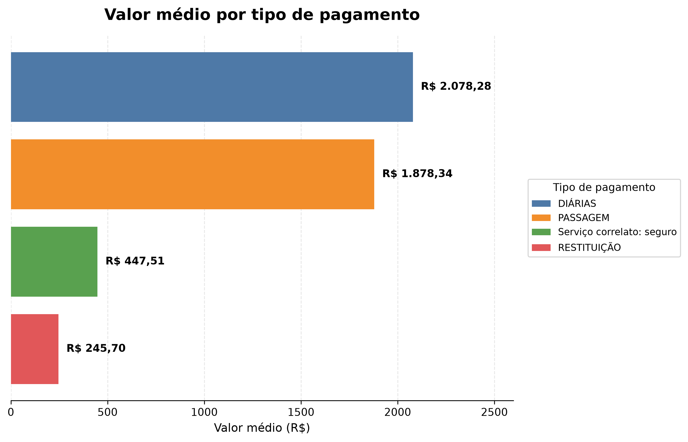
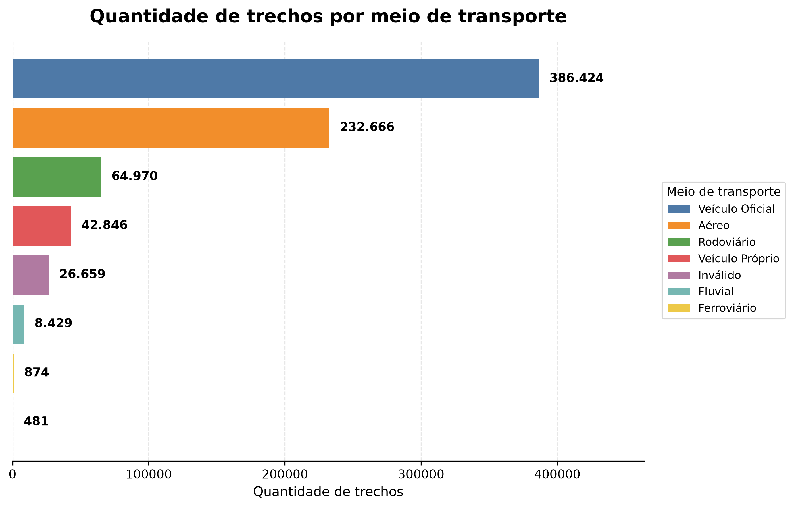
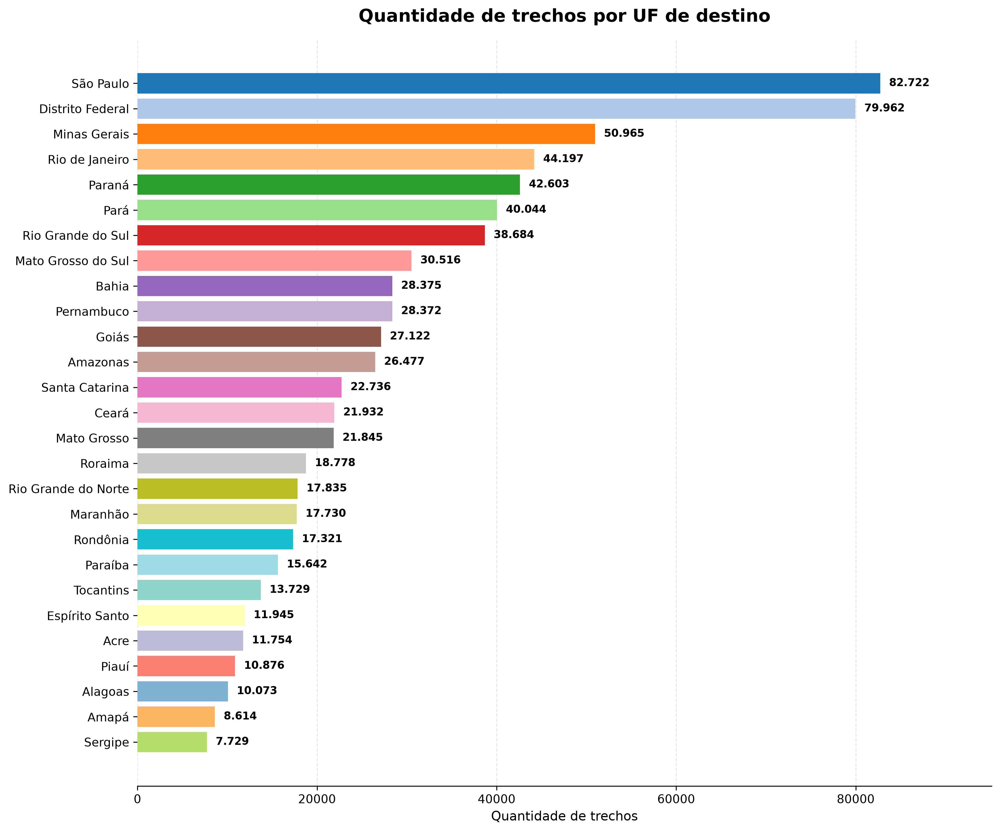
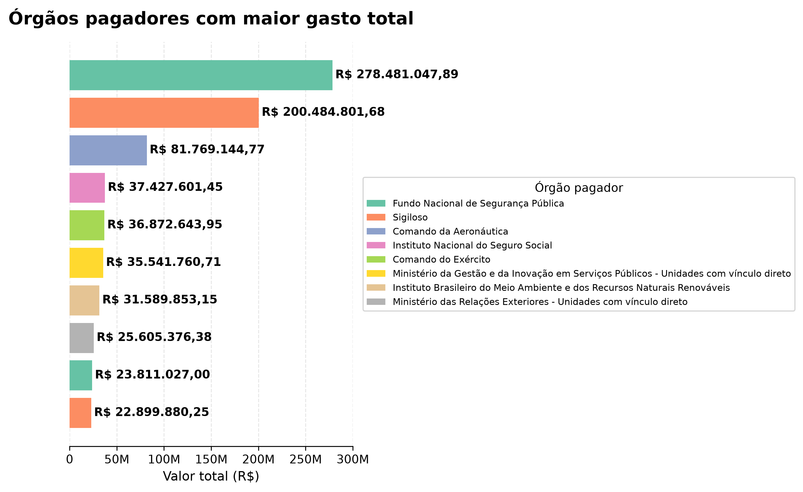

# Pipeline ETL — Viagens a Serviço do Governo Federal

<p align="center">
  <strong>Pipeline de dados em Python e MySQL seguindo a Arquitetura Medallion</strong>
</p>

<p align="center">
  
  
  
  
  
</p>

## Sobre o projeto

Este projeto constrói um pipeline ETL de ponta a ponta para os dados de **Viagens a Serviço do Governo Federal**, disponibilizados pelo Portal da Transparência.

O objetivo é transformar arquivos brutos, originalmente distribuídos em CSV, em uma estrutura confiável para análise. O pipeline automatiza a extração, preserva os dados originais, aplica limpeza e tipagem, garante integridade referencial e produz métricas de negócio na camada Gold.

A base utilizada corresponde a um recorte de **seis meses de 2025**.

## Problema de negócio

Os dados públicos chegam em formato bruto, com campos textuais, valores monetários usando vírgula decimal, datas no formato brasileiro e informações distribuídas em diferentes arquivos.

Para que esses dados possam apoiar decisões e auditorias, é necessário:

- baixar os arquivos sem intervenção manual;
- manter uma cópia fiel da origem;
- converter datas e valores para tipos adequados;
- eliminar inconsistências e duplicidades;
- relacionar viagens, pagamentos, passagens e trechos;
- consolidar indicadores financeiros e operacionais;
- responder perguntas de negócio com tabelas e visualizações.

## Arquitetura da solução

### Camada Raw

Preserva fielmente os quatro arquivos CSV. Todas as colunas permanecem como `VARCHAR`, sem alterações no conteúdo original.

Tabelas:

- `raw_viagem`
- `raw_pagamento`
- `raw_passagem`
- `raw_trecho`

### Camada Silver

Concentra os dados limpos, tipados e relacionados. Nessa camada são aplicadas conversões de datas e valores, padronizações textuais, validações de duplicidade, chaves primárias, chaves estrangeiras e restrições de integridade.

Tabelas:

- `silver_viagem`
- `silver_pagamento`
- `silver_passagem`
- `silver_trecho`

Também são calculadas:

- `valor_total`
- `duracao_dias`

### Camada Gold

A camada Gold consolida pagamentos por órgão superior, órgão pagador e tipo de pagamento.

Foram criadas no MySQL:

- tabela `gold_pagamentos_orgao`;
- view `vw_gold_pagamentos_orgao`.

## Tecnologias e técnicas utilizadas

- **Python** para automação do pipeline;
- **pandas** para leitura em blocos, tratamento e análise;
- **Matplotlib** para visualização;
- **MySQL 8.0** como banco de dados relacional;
- **PyMySQL** para conexão entre Python e MySQL;
- **SQL** para modelagem, transformação, agregação e consultas;
- **python-dotenv** para leitura segura das credenciais;
- **Git e GitHub** para versionamento;
- arquitetura **Medallion** com camadas Raw, Silver e Gold;
- processamento idempotente com limpeza antes das cargas;
- tratamento de exceções com `try/except`, `commit` e `rollback`;
- leitura de CSV em blocos para reduzir o consumo de memória;
- integridade referencial com PK, FK, `NOT NULL`, `CHECK` e `UNIQUE`.

## Estrutura do repositório

```text
.
├── codigos/
│   ├── 0_criar_banco.sql
│   ├── 1_extrair.py
│   ├── 2_transformar.py
│   ├── 3_analise.ipynb
│   ├── banco.py
│   └── config.py
├── docs/
│   └── graficos/
│       ├── 01_top5_orgaos_superiores.png
│       ├── 02_custo_medio_destino.png
│       ├── 03_custo_viagens_maior_duracao.png
│       ├── 04_maior_valor_medio_tipo_pagamento.png
│       ├── 05_meio_transporte_mais_usado.png
│       ├── 06_top_UF_destinos.png
│       └── 07_orgao_maior_gasto_total.png
├── data/
├── .env.example
├── .gitignore
├── requirements.txt
└── README.md
```

## Como executar

### 1. Pré-requisitos

Tenha instalado:

- Python 3;
- MySQL Server 8.0;
- MySQL Workbench;
- Git.

### 2. Clone o repositório

```bash
git clone https://github.com/jpauleti/projeto_transparencia_JeanPauleti_T2.git
cd projeto_transparencia_JeanPauleti_T2
```

### 3. Crie e ative um ambiente virtual

No Windows PowerShell:

```powershell
python -m venv .venv
.\.venv\Scripts\Activate.ps1
```

### 4. Instale as dependências

```powershell
pip install -r requirements.txt
```

### 5. Configure as variáveis de ambiente

Ajuste o arquivo `.env` e informe suas credenciais:

```env
DB_HOST=seu_host
DB_PORT=sua_porta
DB_USER=seu_usuario
DB_PASSWORD=sua_senha
DB_NAME=transparencia_viagens
```

### 6. Crie o banco e as tabelas

Abra no MySQL Workbench e execute:

```text
codigos/0_criar_banco.sql
```

### 7. Execute a extração e carregue a camada Raw

Na raiz do projeto:

```powershell
python codigos\1_extrair.py
```

O script baixa o arquivo ZIP, lê os quatro CSVs em blocos e carrega as tabelas Raw.

### 8. Transforme os dados e carregue a camada Silver

```powershell
python codigos\2_transformar.py
```

Essa etapa converte valores e datas, padroniza campos, calcula as colunas derivadas e valida duplicidades.

### 9. Execute a camada Gold e as análises

Abra:

```text
codigos/3_analise.ipynb
```

Execute as células em ordem. O notebook:

- conecta ao MySQL;
- recria a tabela e a view Gold;
- valida as estruturas criadas;
- responde às perguntas de negócio;
- gera e salva os gráficos em `docs/graficos`;
- encerra a conexão.

## Resultados e perguntas de negócio

### 1. Quais são os cinco órgãos superiores com maior gasto total?

| Posição | Órgão superior | Gasto total |
|---:|---|---:|
| 1 | Ministério da Justiça e Segurança Pública | R$ 486.933.121,65 |
| 2 | Ministério da Defesa | R$ 156.070.304,49 |
| 3 | Ministério da Educação | R$ 111.291.349,34 |
| 4 | Ministério do Meio Ambiente e Mudança do Clima | R$ 49.697.710,16 |
| 5 | Ministério da Previdência Social | R$ 40.417.309,06 |

O Ministério da Justiça e Segurança Pública apresenta gasto muito superior aos demais. Os três primeiros órgãos concentram a maior parte dos valores observados, indicando forte concentração das despesas.



### 2. Quais são os três destinos com maior custo médio por viagem?

| Posição | Destino | Viagens | Custo médio |
|---:|---|---:|---:|
| 1 | Mauá | 1 | R$ 126.214,70 |
| 2 | Cambridge - Massachusetts | 1 | R$ 86.678,04 |
| 3 | Livingstone | 2 | R$ 86.452,66 |

Os maiores custos médios aparecem em destinos com poucas observações. Por isso, esses valores devem ser interpretados com cautela: uma única viagem de alto custo pode posicionar um destino no topo do ranking.



### 3. Qual foi a viagem de maior duração e qual foi seu custo total?

A viagem de maior duração registrada teve **383 dias**, pertence ao **Ministério da Previdência Social** e possui custo total registrado de **R$ 0,00**.

Como esse resultado pode representar ausência de registro financeiro, foi realizada uma análise complementar filtrando apenas viagens com custo positivo. Nesse recorte, a maior duração foi de **378 dias**, vinculada ao **Ministério da Justiça e Segurança Pública**, com custo de **R$ 120.650,00**.

O contraste evidencia a importância de verificar qualidade, completude e significado de valores zerados antes de interpretar indicadores extremos.



### 4. Qual tipo de pagamento apresenta o maior valor médio?

| Tipo de pagamento | Valor total | Quantidade | Valor médio |
|---|---:|---:|---:|
| Diárias | R$ 834.352.643,52 | 401.463 | R$ 2.078,28 |
| Passagem | R$ 354.978.915,13 | 188.985 | R$ 1.878,34 |
| Serviço correlato: seguro | R$ 2.190.136,71 | 4.894 | R$ 447,51 |
| Restituição | R$ 2.843.762,01 | 11.574 | R$ 245,70 |

**Diárias** apresentam o maior valor médio por pagamento e também o maior volume financeiro total entre as categorias analisadas.



### 5. Qual é o meio de transporte mais utilizado nos trechos?

| Posição | Meio de transporte | Quantidade de trechos |
|---:|---|---:|
| 1 | Veículo Oficial | 386.424 |
| 2 | Aéreo | 232.666 |
| 3 | Rodoviário | 64.970 |
| 4 | Veículo Próprio | 42.846 |

O **Veículo Oficial** é o meio de transporte mais utilizado, seguido pelo transporte aéreo. A base também contém registros classificados como “Inválido”, indicando uma oportunidade de melhoria na qualidade do dado de origem.



### 6. Qual UF aparece com maior frequência como destino?

| Posição | UF de destino | Quantidade de trechos |
|---:|---|---:|
| 1 | São Paulo | 82.722 |
| 2 | Distrito Federal | 79.962 |
| 3 | Minas Gerais | 50.965 |
| 4 | Rio de Janeiro | 44.197 |
| 5 | Paraná | 42.603 |

**São Paulo** é o destino mais frequente, com pequena diferença em relação ao Distrito Federal. O resultado sugere concentração dos deslocamentos em grandes centros administrativos e econômicos.



### 7. Qual órgão pagador concentrou o maior volume de pagamentos?

| Posição | Órgão pagador | Valor total |
|---:|---|---:|
| 1 | Fundo Nacional de Segurança Pública | R$ 278.481.047,89 |
| 2 | Sigiloso | R$ 200.484.801,68 |
| 3 | Comando da Aeronáutica | R$ 81.769.144,77 |
| 4 | Instituto Nacional do Seguro Social | R$ 37.427.601,45 |
| 5 | Comando do Exército | R$ 36.872.643,95 |

O **Fundo Nacional de Segurança Pública** concentrou o maior volume de pagamentos. A categoria “Sigiloso” aparece em segundo lugar e limita o detalhamento institucional de uma parcela relevante dos gastos.



## Principais conclusões

A análise aponta concentração financeira e operacional em poucos grupos:

1. O Ministério da Justiça e Segurança Pública lidera com ampla diferença os gastos totais por órgão superior.
2. Diárias representam a categoria de pagamento com maior valor médio e maior valor total.
3. O Fundo Nacional de Segurança Pública é o maior órgão pagador identificado.
4. Veículos oficiais e transporte aéreo dominam o perfil logístico dos trechos.
5. São Paulo e Distrito Federal concentram a maior frequência de destinos.
6. Rankings de custo médio precisam ser avaliados junto com a quantidade de viagens, pois amostras pequenas produzem resultados mais sensíveis a valores extremos.
7. Valores zerados, categorias inválidas e registros sigilosos mostram que transparência e qualidade de dados devem ser analisadas conjuntamente.

## Autor

**Jean Carlos Pauleti**

Projeto desenvolvido como atividade avaliativa do módulo **Análise de Dados com Python [T2]**.
